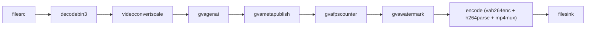

# VLM Alerts

This sample demonstrates an edge AI alerting pipeline using Vision-Language Models (VLMs).

It shows how to:

- Download a VLM from Hugging Face
- Convert it to OpenVINO IR using `optimum-cli`
- Run inference inside a DL Streamer pipeline
- Generate structured JSON alerts per processed frame, including a confidence score
- Produce MP4 output with the inference result overlaid on each frame

## Use Case: Alert-Based Monitoring

VLMs can help accurately detect rare or contextual events using natural language prompts — for example, detecting a police car in a traffic video.
This enables alerting for events, like in prompts:

- Is there a police car?
- Is there smoke or fire?
- Is a person lying on the ground?

## Model Preparation

Any image-text-to-text model supported by optimum-intel can be used. Smaller models (1B-4B parameters) are recommended for edge deployment. For example, OpenGVLab/InternVL3_5-2B.

The script runs:

```code
optimum-cli export openvino \
    --model <model_id> \
    --task image-text-to-text \
    --trust-remote-code \
    <output_dir>
```

Exported artifacts are stored under `models/<ModelName>/`. 
The export runs once and is cached. To skip export, pass `--model-path` directly.

## Video Preparation

Similarly to model, provide either:

- `--video-path` for a local file
- `--video-url` to download automatically

Downloaded videos are cached under `videos/`. 

## Pipeline Architecture

The pipeline is built dynamically in Python using `Gst.parse_launch`.



The `gvagenai` element attaches inference results directly as `GstGVATensorMeta`, which `gvawatermark` reads to render the label and confidence percentage on every frame.

## Setup

1. Create and activate a virtual environment:
```code
cd samples/gstreamer/python/vlm_alerts
python3 -m venv .vlm-venv
source .vlm-venv/bin/activate
```

2. Install dependencies:
```code
curl -LO https://raw.githubusercontent.com/openvinotoolkit/openvino.genai/refs/heads/releases/2026/0/samples/export-requirements.txt
pip install -r export-requirements.txt 
```

> A DL Streamer build that includes the `gvagenai` element is required.

## Running

Required arguments:

- `--prompt`
- `--video-path` or `--video-url`
- `--model-id` or `--model-path`

Example:

```code
python3 vlm_alerts.py \
    --video-url https://videos.pexels.com/video-files/2103099/2103099-hd_1280_720_60fps.mp4 \
    --model-id OpenGVLab/InternVL3_5-2B \
    --prompt "Is there a police car? Answer yes or no."
```

Optional arguments:

| Argument | Default | Description |
|---|---|---|
| `--device` | `GPU` | Inference device |
| `--max-tokens` | `1` | Maximum tokens in the model response |
| `--num-beams` | `4` | Beam search width. Values ≥ 2 enable beam search and produce a confidence score; `1` means greedy decoding with no confidence |
| `--frame-rate` | `1.0` | Frames per second passed to `gvagenai` |
| `--videos-dir` | `./videos` | Directory for downloaded videos |
| `--models-dir` | `./models` | Directory for exported models |
| `--results-dir` | `./results` | Directory for output files |

## Output

```
results/<ModelName>-<video_stem>.jsonl
results/<ModelName>-<video_stem>.mp4
```

The `.jsonl` file contains one JSON record per processed frame. 
The `.mp4` file contains the processed video with the inference result and confidence percentage overlaid on every frame.

### Help

To display all available arguments and defaults:

```code
python3 vlm_alerts.py --help
```
